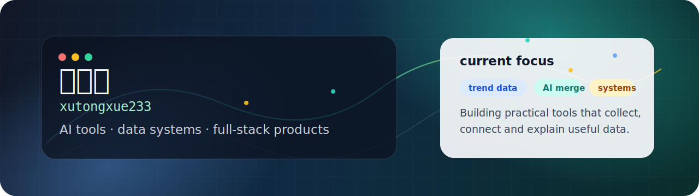

<p align="center">
  
</p>

<h1 align="center">徐同学 / xutongxue233</h1>

<p align="center">
  I build practical software around AI tools, data systems and full-stack products.
  <br />
  正在把数据采集、趋势分析、业务系统和 AI 能力做成真实可运行的产品。
</p>

<p align="center">
  <a href="https://github.com/xutongxue233?tab=repositories">Projects</a>
  ·
  <a href="https://github.com/xutongxue233/hotspot-tracking-system">Current Build</a>
  ·
  <a href="https://github.com/xutongxue233?tab=stars">Stars</a>
</p>

---

### Now

I am currently building [hotspot-tracking-system](https://github.com/xutongxue233/hotspot-tracking-system), a cross-platform trending topics tracker for Baidu, Weibo, Douyin and Bilibili.

It collects public hot lists, stores rank snapshots, builds platform and overall leaderboards, supports custom keyword boards, and experiments with DeepSeek-powered topic merging.

### Selected Work

| Project | What it is | Stack / Area |
| --- | --- | --- |
| [hotspot-tracking-system](https://github.com/xutongxue233/hotspot-tracking-system) | Real-time hot list tracker with rank snapshots, overall leaderboard, keyword boards and AI topic merge. | Next.js, Fastify, Prisma, SQLite, DeepSeek |
| [AI-sensitive-word-detection-system](https://github.com/xutongxue233/AI-sensitive-word-detection-system) | AI sensitive word detection system for text moderation scenarios. | Java, AI, Moderation |
| [tiny-platform](https://github.com/xutongxue233/tiny-platform) | Modular enterprise admin platform with users, roles, permissions, menus and RBAC foundations. | Spring Boot, React, RBAC |
| [RuoYi-Plus-React](https://github.com/xutongxue233/RuoYi-Plus-React) | React-based RuoYi-Vue-Plus admin platform implementation. | Java, React, Admin |
| [wanjielunhui](https://github.com/xutongxue233/wanjielunhui) | Text-based cultivation game prototype. | TypeScript, Game |
| [video-workflow](https://github.com/xutongxue233/video-workflow) | Automated short-video workflow for 3D printing lead generation. | TypeScript, Automation |

### What I Care About

- Turning AI features into product workflows instead of one-off demos.
- Building data pipelines that make trends observable over time.
- Designing local-first development loops that are cheap to start and easy to move to production.
- Shipping admin systems with clear permission models, stable APIs and maintainable UI.

### Toolbox

```text
Frontend    React · Next.js · TypeScript · Tailwind CSS
Backend     Node.js · Fastify · Java · Spring Boot · Python
Data        SQLite · Prisma · MySQL · ranking snapshots · crawler pipelines
AI          DeepSeek API · moderation workflows · topic merge experiments
Product     admin systems · automation tools · games · trend dashboards
```

### Small Notes

This profile is intentionally simple: fewer badges, more signal. Most of my public work is built around usable prototypes, operational tools and systems that can keep running after the first demo.

---

<p align="center">
  <sub>Build small, make it real, then keep improving the system.</sub>
</p>
